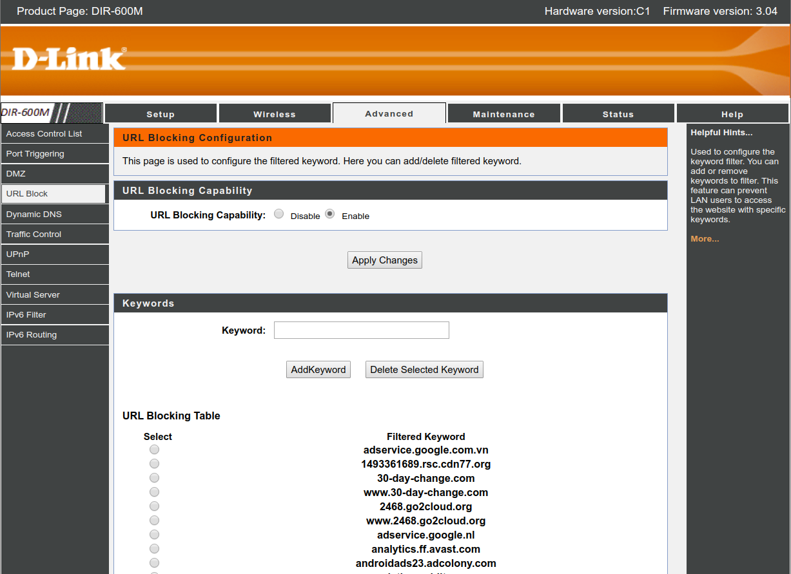

# selenium-router-cli [](https://www.npmjs.com/package/selenium-router-cli)

> Automate Router Domain Blacklisting for DLink Router

### Warning

This CLI is tested only on Dlink DIR-600M. Do not use the CLI if your router is of a different model id.

## Install

Ensure you have [Node.js](https://nodejs.org) 8 or later installed. Then run the following:

```
$ npm install --global selenium-router-cli
```

## Usage

```
$ selenium-router-cli --help

  Automate Router Domain Blacklisting for DLink Router

  Options
		-u, --username TEXT    Router Dashboard username
		-p, --password TEXT    Router Dashboard password
		-g, --gateway TEXT	   Router Gateway IP
		-v, --version          Show the version and exit with code 0

	Examples
		$ selenium-router-cli --username "ROUTER_USERNAME" --password "ROUTER_PASSWORD"
		$ selenium-router-cli -u "ROUTER_USERNAME" -p "ROUTER_PASSWORD" -g "10.1.1.2"
```

## Dashboard



## License

MIT © [Abhijith Vijayan](https://abhijithvijayan.in)
